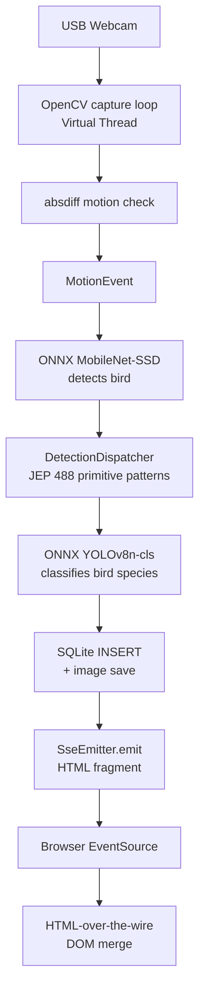

# Wildtype

> A Raspberry Pi bird-watching camera written in Java 26 that watches your yard and tells you which bird species visited.

Two-stage edge AI inference (detect bird → classify species), SQLite journaling, and a live HTML-over-the-wire dashboard — all running on a Pi, written entirely in Java 26.

[](https://openjdk.org/projects/jdk/26/)
[](https://spring.io/projects/spring-boot)
[](https://onnxruntime.ai/)
[](https://just.systems/)

## What It Does

1. **Watches** — USB webcam captures frames on a Virtual Thread
2. **Detects motion** — OpenCV `absdiff` background subtraction
3. **Detects** — ONNX MobileNet-SSD finds birds (COCO class 15) in the frame (~90 ms on Pi 4)
4. **Classifies** — ONNX YOLOv8n-cls identifies the exact bird species from a 25-class dataset (~40 ms on Pi 4)
5. **Records** — SQLite stores species, confidence, timestamp, image path
6. **Streams** — Server-Sent Events push live HTML cards to every open browser

## Quick Start

```bash
# 1. Clone and build
just build

# 2. Run (laptop with webcam, or Pi with USB camera)
just run

# 3. Open http://localhost:8081
#    Login: wildtype (configurable via wildtype.password)
```

To disable the vision pipeline and use the debug API instead:

```bash
just run-debug
```

Inject a test sighting:

```bash
just debug-sighting
```

## Hardware

| Item                | Qty | Est. Cost  | Notes                       |
| ------------------- | --- | ---------- | --------------------------- |
| Raspberry Pi 4/5    | 1   | BYOD       | 64-bit OS                   |
| MicroSD + PSU       | 1   | BYOD       | Already owned               |
| USB Webcam (720p)   | 1   | $15–25     | Logitech C270 or equivalent |
| 3D-printed tray     | 1   | $1         | Single-piece, 30-min print  |
| M2.5 screws         | 2   | $0         | Pi mounting                 |
| **Total purchased** | —   | **$15–25** | —                           |

Enclosure: [`enclosure/tray.scad`](enclosure/tray.scad) — print in PLA, 0.3mm layer, 20% infill.

## Architecture



## Java 26 JEP Showcase

### JEP 485 — Stream Gatherers

Custom gatherers for the detection pipeline:

```java
// Filters consecutive same-label detections within a cooldown window
public static <T> Gatherer<T, ?, T> cooldown(
        Function<T, String> keyExtractor, Duration window, double minConfidence) {
    return Gatherer.ofSequential(
            State::new,
            (state, element, downstream) -> {
                String key = keyExtractor.apply(element);
                return state.allow(key, window) ? downstream.push(element) : true;
            });
}
```

```java
// Filters detections below confidence threshold
public static <T> Gatherer<T, ?, T> aboveThreshold(
        Function<T, Float> confidenceExtractor, float threshold) {
    return Gatherer.ofSequential(
            () -> null,
            (state, element, downstream) -> {
                float confidence = confidenceExtractor.apply(element);
                return confidence >= threshold ? downstream.push(element) : true;
            });
}
```

### JEP 488 — Primitive Type Patterns

Filters low-confidence COCO detections using a **primitive type pattern** (`int id`) with a `when` guard:

```java
public boolean isInteresting(int classId, float confidence) {
    return switch (classId) {
        case int id when id == 15 && confidence >= 0.40f -> true;
        default -> false;
    };
}
```

### JEP 491 — Virtual Threads

No explicit `ThreadPoolExecutor` anywhere:

```properties
# Spring Boot Tomcat serves every request on a virtual thread
server.tomcat.threads.virtual.enabled=true
```

```java
// Vision capture runs on its own virtual thread
@PostConstruct
public void start() {
    captureThread = Thread.startVirtualThread(this::runLoop);
}
```

Concurrent workloads — capture, ONNX inference (blocking native call), SQLite write, and multiple open SSE connections — all run on virtual threads.

### JEP 487 — Scoped Values

Context flows from motion detection through inference to the repository layer without parameter drilling or `ThreadLocal`:

```java
public static final ScopedValue<SightingContext> CTX = ScopedValue.newInstance();

ScopedValue.where(CTX, new SightingContext("backyard", Instant.now()))
    .run(() -> pipeline.process(frame));

// Inside service layer:
String cam = SightingContextHolder.get().cameraId();
```

## Models

Two ONNX models are required:

| Model          | File                                                    | Size    | Source                                               |
| -------------- | ------------------------------------------------------- | ------- | ---------------------------------------------------- |
| **Detector**   | `app/src/main/resources/models/mobilenet-ssd.onnx`      | ~28 MB  | ONNX Model Zoo (auto-downloaded by `just model`)     |
| **Classifier** | `app/src/main/resources/models/animal_species_cls.onnx` | ~5.6 MB | Trained locally via `python train_animal_species.py` |

The classifier is a YOLOv8n-cls model fine-tuned on the `ViratGarg/animal_species` Hugging Face dataset (8,750 images, 25 Indian bird species). It is **gitignored** — you must train it after cloning.

### Training the classifier

Requires Python 3.10+ with `pip3`:

```bash
# 1. Install dependencies
pip3 install ultralytics datasets pillow huggingface_hub

# 2. Set Hugging Face token (for higher download rate limits)
echo "HF_TOKEN=hf_..." > .env

# 3. Train and export
python3 train_animal_species.py
```

The script downloads the dataset, reorganises it into YOLO classification layout, trains for 50 epochs, and exports the best checkpoint to `app/src/main/resources/models/animal_species_cls.onnx`.

If you don't have a GPU, training on CPU takes ~45 minutes for the full 8,750-image dataset.

## Technology Stack

| Layer      | Tech                                                                    | Why                                               |
| ---------- | ----------------------------------------------------------------------- | ------------------------------------------------- |
| Language   | Java 26                                                                 | Contest requirement; 4 JEPs showcased             |
| Build      | Gradle                                                                  | `sourceCompatibility = JavaVersion.VERSION_26`    |
| Camera     | `org.openpnp:opencv`                                                    | Pre-built aarch64 native libs                     |
| Vision AI  | ONNX Runtime Java + MobileNet SSD (detector) + YOLOv8n-cls (classifier) | Two-stage: detect bird, then classify species     |
| Dataset    | `ViratGarg/animal_species` (Hugging Face)                               | 25-class Indian bird species dataset              |
| Database   | SQLite + `sqlite-jdbc` + JdbcTemplate                                   | Zero-config, file-based, survives reboots         |
| Web        | Spring Boot 3.5 + Tomcat virtual threads                                | One-line VT activation                            |
| Frontend   | Thymeleaf + raw SSE                                                     | Server pushes HTML fragments; browser merges them |
| Formatting | palantir-java-format                                                    | Consistent style across all source                |

## SQLite Schema

```sql
CREATE TABLE sightings (
    id INTEGER PRIMARY KEY AUTOINCREMENT,
    detected_at TEXT NOT NULL,    -- ISO-8601
    species TEXT NOT NULL,
    confidence REAL NOT NULL,
    image_path TEXT NOT NULL
);

CREATE INDEX idx_sightings_time ON sightings(detected_at DESC);
```

## HTML-over-the-Wire SSE

The dashboard uses server-sent HTML fragments instead of JSON APIs:

1. Initial page is server-rendered Thymeleaf
2. `EventSource` receives HTML fragments pushed from the Pi
3. A 5-line JS snippet merges them into the DOM

No JSON APIs. No React. No polling. Just server-sent HTML fragments via Java Virtual Threads.

## Development

```bash
# Format all Java
just fmt

# Run tests
just test

# Build
just build

# Run with webcam
just run

# Run without vision (debug API only)
just run-debug

# Inject test data
just debug-sighting

# Download the detection model
just model

# Train the species classifier (needs Python + HF_TOKEN in .env)
python3 train_animal_species.py

# Clean everything
just clean
```

## Pi Deployment

See [`PI_TRANSFER.md`](PI_TRANSFER.md) for SD card setup, Java 26 install, project transfer, and systemd auto-start.

## Pages

- `/` — Dashboard with live SSE updates, species badges, and sighting cards
- `/login` - Login page
- `/sightings/{id}` — Detail page for a single sighting with full-size image

## License

- **Code**: MIT
- **MobileNet-SSD model**: Apache 2.0 (ONNX Model Zoo)
- **YOLOv8n-cls base model**: AGPL-3.0 (Ultralytics)
- **Animal species dataset**: CC BY 4.0 (ViratGarg / Hugging Face)
- **OpenCV**: Apache 2.0
- **ONNX Runtime**: MIT
